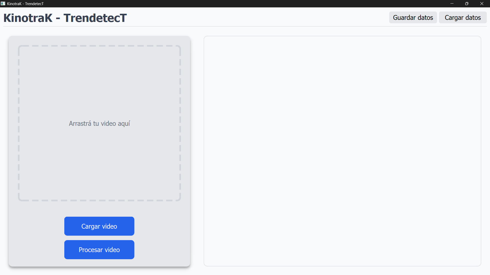
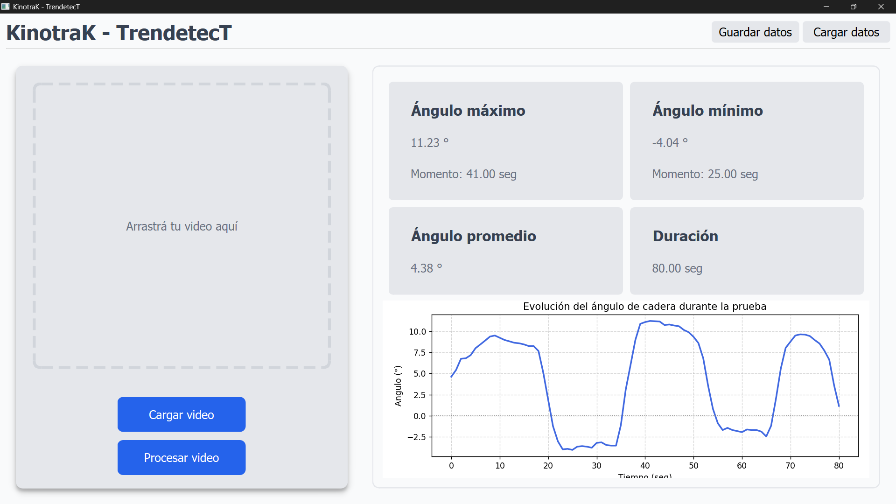

# TrendetecT - Trendelenburg Test Analysis Tool

[](https://opensource.org/licenses/MIT)
[](https://www.python.org/)
[](https://opencv.org/)

A Python-based desktop application for automated analysis of the Trendelenburg test using ArUco marker tracking and computer vision.


*Main application interface*


*Analysis results with angle-time graph*

## 📖 About

TrendetecT was developed during professional internship practices in Biomedical Engineering at [Universidad Nacional de Entre Ríos (UNER)](https://www.uner.edu.ar/), Facultad de Ingeniería, in collaboration with [Hospital de la Baxada](https://www.hospitaldelabaxada.com.ar/).

The application assists physiotherapy professionals in performing objective measurements of angles and timing during the Trendelenburg test, replacing subjective visual assessment with precise computer vision-based analysis.

**Project Status**: Validation Phase - Currently being tested with physiotherapy professionals at Hospital de la Baxada.

## 🎯 Purpose

The Trendelenburg test is a clinical assessment used to evaluate hip abductor muscle strength and pelvic stability. Traditional visual assessment can be subjective and imprecise. TrendetecT provides:

- Objective angle measurements throughout the test
- Precise timing data
- Graphical visualization of test progression
- Repeatable and comparable results
- Data export for clinical records

## ✨ Features

- **Video Import**: Load test videos via button or drag-and-drop
- **ArUco Marker Tracking**: Automated detection and tracking of hip and leg positions
- **Real-time Playback**: Video loops within the application for review
- **Comprehensive Analysis**:
  - Maximum angle
  - Minimum angle
  - Average angle
  - Test duration
- **Graphical Visualization**: Time vs. Angle plot for test progression
- **Data Management**: Save and load analysis results in CSV format
- **Spanish Interface**: Designed for Spanish-speaking healthcare professionals

## 🔬 Technical Specifications

### Marker Placement

The test requires three ArUco markers positioned on the patient:

1. **Left Hip**: Anterior Superior Iliac Spine (ASIS)
2. **Right Hip**: Anterior Superior Iliac Spine (ASIS)
3. **Contralateral Leg**: Longitudinal midpoint of the tibia (on the non-weight-bearing leg)

### ArUco Configuration

- **Dictionary**: DICT_6X6_250
- **Recommended Marker Size**: 200x200 pixels (printed)
- **Camera Distance**: Approximately 3 meters (full body visible, markers clearly distinguishable)

### Video Requirements

- **Format**: MP4
- **Resolution**: Standard smartphone resolution (tested with mobile phone recordings)
- **Framing**: Full body visible with all three ArUco markers in frame throughout the test

## 🚀 Getting Started

### Prerequisites

- Python 3.13.5 or compatible version
- pip (Python package manager)

### Installation

1. Clone the repository:
```bash
git clone https://github.com/Lucio-Sepulveda/trendetect-trendelenburg-test.git
cd trendetect-trendelenburg-test
```

2. Install dependencies:
```bash
pip install -r requirements.txt
```

### Running the Application

Execute the main GUI file:
```bash
python gui.py
```

## 📋 Usage Workflow

1. **Load Video**: Click "Cargar Video" button or drag video file into the designated area
2. **Review**: Video will play in loop within the application
3. **Process**: Click "Procesar Video" button to start analysis
4. **Wait**: Progress bar indicates processing status
5. **View Results**: Analysis results and graph are displayed automatically
6. **Save/Load**: Use top-right buttons to save results as CSV or load previous analyses

## 🛠️ Technology Stack

- **Language**: Python 3.13.5
- **Computer Vision**: OpenCV (cv2) with ArUco module
- **GUI Framework**: PySide6
- **Data Processing**: NumPy, Pandas
- **Visualization**: Matplotlib

## 📊 Output Data

Results are exported in CSV format containing:
- Maximum angle (degrees)
- Minimum angle (degrees)
- Average angle (degrees)
- Test duration (seconds)
- Time-series angle data for graphing

## 🔄 Project Roadmap

- [x] Core angle measurement functionality
- [x] Video processing and ArUco tracking
- [x] Graphical user interface
- [x] Data save/load functionality
- [ ] Validation with physiotherapy professionals at Hospital de la Baxada
- [ ] Desktop application export (standalone executable)
- [ ] Extended testing with diverse patient videos
- [ ] User feedback implementation
- [ ] Clinical deployment

## ⚠️ Current Limitations

- Application tested with limited video samples
- Requires validation with healthcare professionals
- Spanish-only interface (internationalization pending)
- Requires Python environment (standalone executable in development)

## 🏥 Clinical Context

This tool was developed in collaboration with the physiotherapy department at Hospital de la Baxada to improve the objectivity and reproducibility of Trendelenburg test assessments in clinical practice.

**Important**: This software is intended as a clinical aid tool and should be used in conjunction with professional clinical judgment. Always consult with qualified healthcare professionals for medical decisions.

## 👨‍💻 Author

**Lucio Sepúlveda**  
Biomedical Engineering Student  
Universidad Nacional de Entre Ríos (UNER) - Faculty of Engineering

Developed as part of professional internship practices in collaboration with Hospital de la Baxada.

## 🙏 Acknowledgments

- Hospital de la Baxada physiotherapy team for their collaboration and clinical expertise
- UNER Faculty of Engineering for internship support
- Healthcare professionals participating in the validation phase

## 📄 License

This project is licensed under the MIT License - see the LICENSE file for details.

## 🔗 Links

- [Universidad Nacional de Entre Ríos](https://www.uner.edu.ar/)
- [Hospital de la Baxada](https://www.hospitaldelabaxada.com.ar/)
- [OpenCV ArUco Documentation](https://docs.opencv.org/4.x/d5/dae/tutorial_aruco_detection.html)

---

*Developed for clinical use at Hospital de la Baxada - 2025*